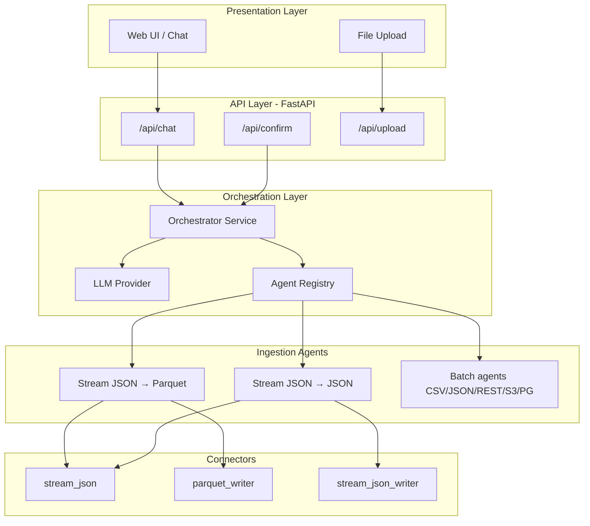
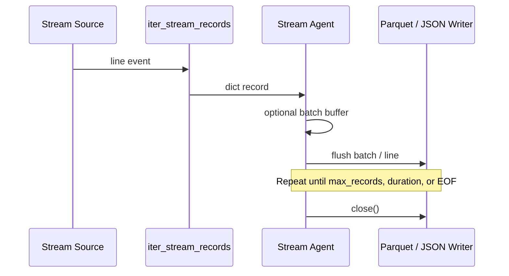
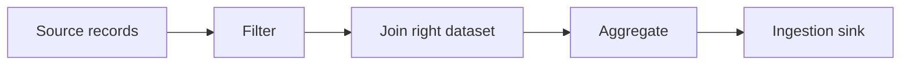
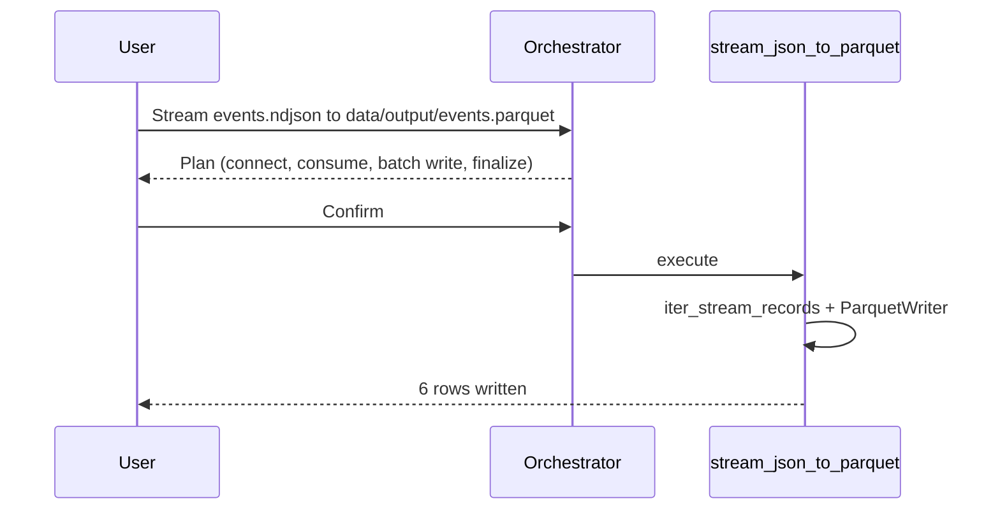

# SMART AI Ingestion Tool — Design Document

**Version:** 1.3  
**Date:** 2026-06-01

---

## 1. Architecture Overview



---

## 2. Streaming JSON Pipeline

### 2.1 Source adapters

| Adapter | Protocol | Parser |
|---------|----------|--------|
| Local NDJSON | File `.ndjson` / `.jsonl` | Read line-by-line (simulates live stream in tests) |
| HTTP stream | GET `stream_url` | `httpx` `iter_lines()`; supports NDJSON and SSE `data:` lines |

### 2.2 Stream record flow



### 2.3 Sink writers

| Sink | Class | Behavior |
|------|-------|----------|
| Parquet | `StreamingParquetWriter` | Arrow `ParquetWriter`; one row group per batch; schema alignment for evolving events |
| JSON NDJSON | `StreamingJsonWriter` | Append one JSON line per record |
| JSON array | `StreamingJsonWriter` | Incremental `[` … `]` file |

### 2.4 Intent fields (streaming)

| Field | Purpose |
|-------|---------|
| `source_type` | `stream_json` |
| `dest_type` | `parquet` or `json_file` |
| `stream_url` | HTTP(S) NDJSON/SSE endpoint |
| `source_path` | Local NDJSON file (alternative to URL) |
| `dest_path` | Output `.parquet`, `.ndjson`, or `.json` |
| `options.batch_size` | Parquet flush size (default `STREAM_BATCH_SIZE`) |
| `options.max_records` | Stop after N events |
| `options.duration_seconds` | Stop after elapsed time |
| `options.json_format` | `ndjson` \| `json_array` |

---

## 3. Agent Catalog

| Agent ID | Source | Destination | Required |
|----------|--------|-------------|----------|
| `stream_json_to_parquet` | Streaming JSON | Parquet | stream_url **or** source_path, dest_path |
| `stream_json_to_json` | Streaming JSON | JSON file | stream_url **or** source_path, dest_path |
| `csv_to_sqlite` | CSV | SQLite | source_path, table_name |
| `csv_to_postgresql` | CSV | PostgreSQL | source_path, table_name |
| `csv_to_s3` | CSV | S3 | source_path, s3_bucket, s3_key |
| `s3_to_sqlite` | S3 CSV | SQLite | s3_bucket, s3_key, table_name |
| `json_to_sqlite` | JSON array file | SQLite | source_path, table_name |
| `rest_to_json` | REST | JSON file | api_url, dest_path |
| `csv_to_csv` | CSV | CSV | source_path, dest_path |

**Matching:** Highest `matches()` score ≥ 0.5; streaming agents registered first for tie-break.

---

## 4. Transform pipeline



| Stage | Model | Notes |
|-------|-------|-------|
| Filter | `FilterSpec.conditions[]` | AND logic; dotted field paths |
| Join | `JoinSpec` | Load `right_source_path` via `record_loader` |
| Aggregate | `AggregateSpec` | `group_by` + metrics |

**Orchestrator collection:** `transform_collector.transform_missing_fields()` after agent fields; prompts `filter_field`, `join_right_source_path`, `aggregate_group_by`, etc.

**Streaming:** `needs_full_buffer()` true when join or aggregate present; else per-record filter only.

---

## 5. Component Design

### 4.1 Session state machine

Unchanged from v1.0 (`idle` → `collecting` → `awaiting_confirmation` → `executing` → `completed`/`failed`).

### 4.2 Orchestrator

When `pending_field == "stream_url"` and user replies with a file path, orchestrator maps to `source_path` instead.

### 4.3 LLM providers

| Provider | Streaming keywords |
|----------|-------------------|
| `RuleBasedLLM` | stream, real-time, ndjson, parquet, sse |
| `OpenAILLM` | Tool `set_ingestion_intent` includes `stream_url`, `options` |

---

## 5. API Design

| Method | Path | Description |
|--------|------|-------------|
| POST | `/api/chat` | Conversation turn |
| POST | `/api/confirm` | Execute or cancel plan |
| POST | `/api/upload` | Multipart file → `uploads/` |
| GET | `/api/agents` | Agent metadata |
| GET | `/api/health` | Status + `llm_provider` |

---

## 6. Directory Layout

```
src/smart_ingestion/
  connectors/
    stream_json.py       # iter_stream_records, batched
    parquet_writer.py    # StreamingParquetWriter
    stream_json_writer.py
  agents/
    stream_json_base.py
    stream_json_to_parquet.py
    stream_json_to_json.py
test_data/
  events.ndjson          # streaming fixture (6 events)
```

---

## 7. Security

- Stream URLs: `http://` / `https://` only
- Read paths: allowed roots include `test_data`, `uploads`, `data/output`
- Write paths: `data/output` (and test tmp via pytest monkeypatch)
- No user-supplied SQL in streaming agents

---

## 8. Testing Strategy

| Test | Coverage |
|------|----------|
| `test_stream_agents.py` | NDJSON → Parquet (row count, pyarrow read), NDJSON → NDJSON, JSON array |
| `test_stream_agents.py` | Orchestrator routing to `stream_json_to_parquet` |
| `test_llm.py` | Rule-based stream keyword extraction |

Optional future: `httpx` mock transport for live URL streams.

---

## 9. Deployment

```bash
pip install -r requirements.txt  # includes pyarrow
uvicorn smart_ingestion.main:app --reload --app-dir src
```

Environment:

```env
STREAM_BATCH_SIZE=50
```

---

## 10. Streaming sequence (happy path)


