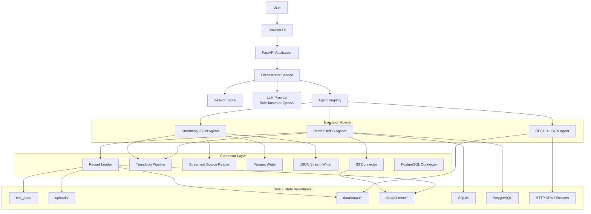
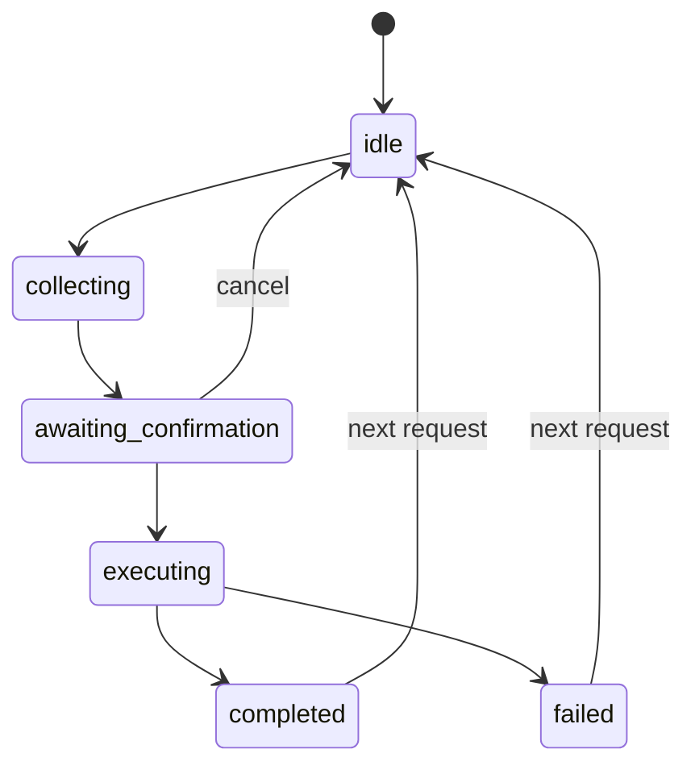
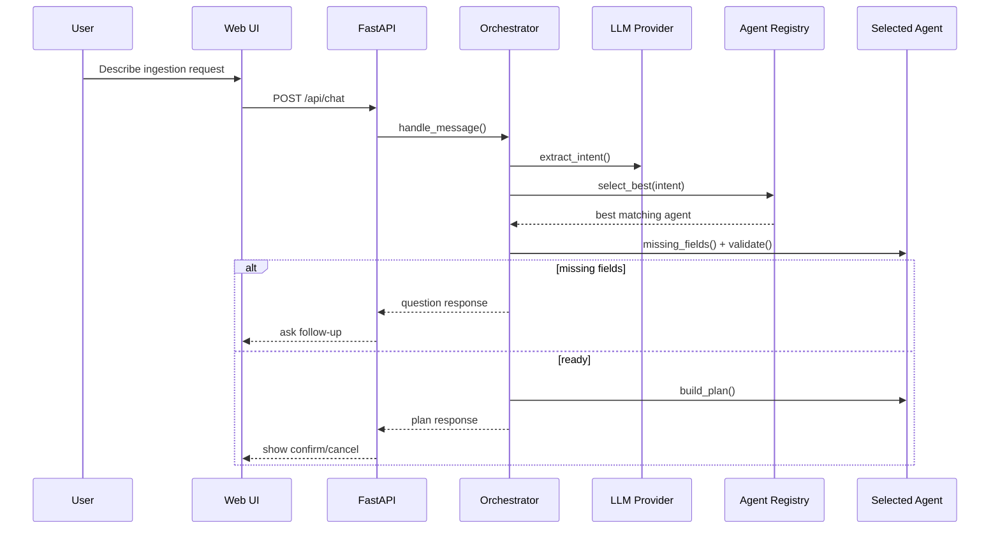
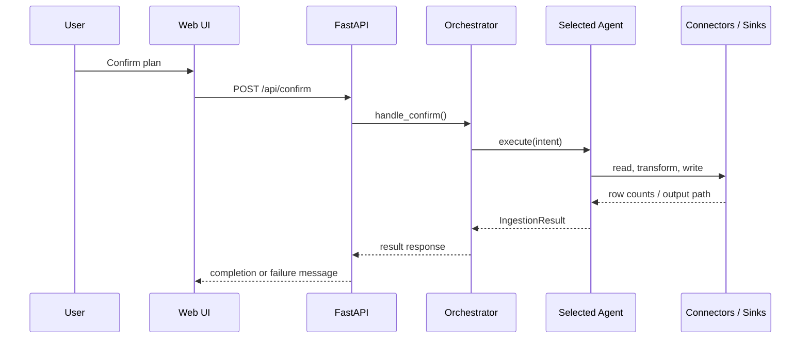
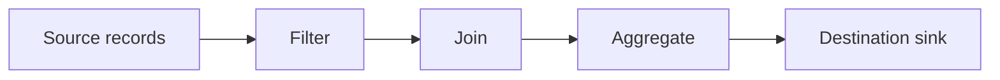
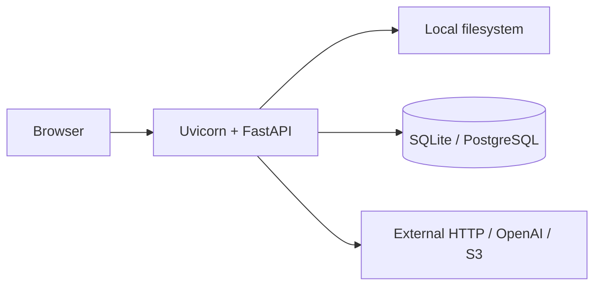

# SMART AI Ingestion Tool - System Architecture

**Version:** 1.0  
**Date:** 2026-06-05

## 1. Purpose

This project is a chat-driven ingestion system that converts a natural-language request into a validated data movement plan, pauses for user confirmation, and then executes the selected ingestion pipeline.

The canonical runtime code lives under `src/smart_ingestion/`. The root-level `agents/` and `connectors/` folders are not part of the main application import path.

## 2. High-Level Architecture

## 3. Main Components

### 3.1 Presentation Layer

- `src/smart_ingestion/static/index.html`
- `src/smart_ingestion/static/app.js`
- `src/smart_ingestion/static/styles.css`

Responsibilities:

- Collect natural-language ingestion requests.
- Upload source files into `uploads/`.
- Display clarifying questions, plans, and execution results.
- Call `/api/chat`, `/api/confirm`, `/api/upload`, and `/api/agents`.

### 3.2 API Layer

- `src/smart_ingestion/main.py`

Responsibilities:

- Expose the FastAPI application.
- Serve the static chat UI.
- Persist uploads to `UPLOADS_DIR`.
- Route chat and confirmation requests to the orchestrator.

Endpoints:

- `GET /`
- `GET /api/health`
- `GET /api/agents`
- `POST /api/upload`
- `POST /api/chat`
- `POST /api/confirm`

### 3.3 Orchestration Layer

- `src/smart_ingestion/orchestrator.py`
- `src/smart_ingestion/session.py`
- `src/smart_ingestion/models.py`
- `src/smart_ingestion/transform_collector.py`

Responsibilities:

- Manage conversational session state.
- Merge new user input into an evolving `IngestionIntent`.
- Select the best ingestion agent through the registry.
- Ask for missing source, destination, or transform fields.
- Build an execution plan and require confirmation before side effects.
- Execute the chosen agent and return a structured result.

Session state machine:

### 3.4 Intent Extraction Layer

- `src/smart_ingestion/llm/factory.py`
- `src/smart_ingestion/llm/base.py`
- `src/smart_ingestion/llm/rule_based.py`
- `src/smart_ingestion/llm/openai_llm.py`
- `src/smart_ingestion/llm/transform_extract.py`

Responsibilities:

- Convert free-form user text into structured intent fields.
- Infer source type, destination type, paths, table names, stream URLs, and options.
- Extract requested transforms such as filter, join, and aggregate.
- Support a deterministic default parser and an optional OpenAI-backed provider.

### 3.5 Agent Layer

- `src/smart_ingestion/agents/base.py`
- `src/smart_ingestion/agents/registry.py`
- `src/smart_ingestion/agents/*.py`

Responsibilities:

- Encapsulate pipeline-specific matching, validation, planning, and execution.
- Provide a uniform contract: `matches()`, `validate()`, `build_plan()`, `execute()`.
- Keep side-effecting ingestion logic out of the orchestrator.

Current agent catalog:

| Agent ID | Flow |
|----------|------|
| `csv_to_sqlite` | CSV -> SQLite |
| `csv_to_postgresql` | CSV -> PostgreSQL |
| `csv_to_s3` | CSV -> S3 |
| `s3_to_sqlite` | S3 CSV -> SQLite |
| `json_to_sqlite` | JSON array -> SQLite |
| `rest_to_json` | REST API -> JSON file |
| `csv_to_csv` | CSV -> CSV |
| `stream_json_to_parquet` | Streaming JSON -> Parquet |
| `stream_json_to_json` | Streaming JSON -> JSON/NDJSON |

### 3.6 Connector Layer

- `src/smart_ingestion/connectors/record_loader.py`
- `src/smart_ingestion/connectors/ingestion_pipeline.py`
- `src/smart_ingestion/connectors/transforms.py`
- `src/smart_ingestion/connectors/stream_json.py`
- `src/smart_ingestion/connectors/parquet_writer.py`
- `src/smart_ingestion/connectors/stream_json_writer.py`
- `src/smart_ingestion/connectors/s3.py`
- `src/smart_ingestion/connectors/postgresql.py`

Responsibilities:

- Load source records from CSV, JSON, and NDJSON files.
- Apply filter, join, and aggregate transforms.
- Read streaming JSON from local NDJSON files or HTTP/SSE sources.
- Write outputs to Parquet, JSON, SQLite, PostgreSQL, and S3-backed storage.

## 4. Runtime Request Flow

### 4.1 Chat-to-plan flow

### 4.2 Confirm-to-execution flow

## 5. Data Processing Model

### 5.1 Intent model

The central contract is `IngestionIntent`, which carries:

- Source classification: `csv`, `json`, `rest`, `s3`, `stream_json`
- Destination classification: `sqlite`, `postgresql`, `s3`, `json_file`, `csv_file`, `parquet`
- Source and destination paths or URLs
- Table names and connection parameters
- Optional `options` for streaming controls
- Optional `transform` specification

The orchestrator incrementally merges partial user input into the same intent across turns.

### 5.2 Transform model

Transforms are applied in a fixed order:

Rules:

- `filter` can run per record or over a batch.
- `join` requires loading a right-side dataset from an allowed path.
- `aggregate` groups records and computes derived metrics.
- Streaming agents switch to full-buffer mode when join or aggregate is requested.

## 6. Storage and Integration Boundaries

Configured in `src/smart_ingestion/config.py` and enforced by `src/smart_ingestion/utils.py`.

Allowed read roots:

- `test_data/`
- `uploads/`
- `data/output/`
- `data/s3-mock/`

Allowed write roots:

- `uploads/`
- `data/output/`
- `data/s3-mock/`

External integrations:

- OpenAI API, when `LLM_PROVIDER=openai`
- HTTP REST APIs for `rest_to_json`
- HTTP/SSE/NDJSON streams for streaming agents
- PostgreSQL through configured connection URL
- AWS S3 or local mock S3 storage

## 7. Deployment View

Single-process default deployment:

Characteristics:

- Stateless API process except for in-memory session store.
- Session continuity depends on the current process instance.
- Best suited for local use, demos, and controlled single-node deployments.

## 8. Architectural Strengths and Constraints

Strengths:

- Clear separation between orchestration, agent selection, and execution logic.
- Confirmation gate prevents accidental side effects.
- Deterministic rule-based mode makes tests stable.
- Agent abstraction makes new pipelines straightforward to add.
- Path restrictions reduce unsafe file access.

Constraints:

- Session state is in-memory only and not shared across processes.
- Agent registry is static and instantiated at startup.
- Most batch connectors operate synchronously inside the API process.
- Transform execution is in-process and memory-bound for join/aggregate workloads.
- Runtime does not currently include a queue, worker pool, or persistent job tracking.

## 9. Extension Points

Recommended extension seams:

1. Add a new pipeline by implementing a new agent and registering it in `agents/registry.py`.
2. Add a new source or sink by introducing a connector and using it from an agent.
3. Improve intent extraction by extending `RuleBasedLLM` keywords or the OpenAI tool schema.
4. Replace the in-memory session store with a shared persistence layer for multi-instance deployment.
5. Move agent execution into background workers if long-running ingestion becomes a requirement.
